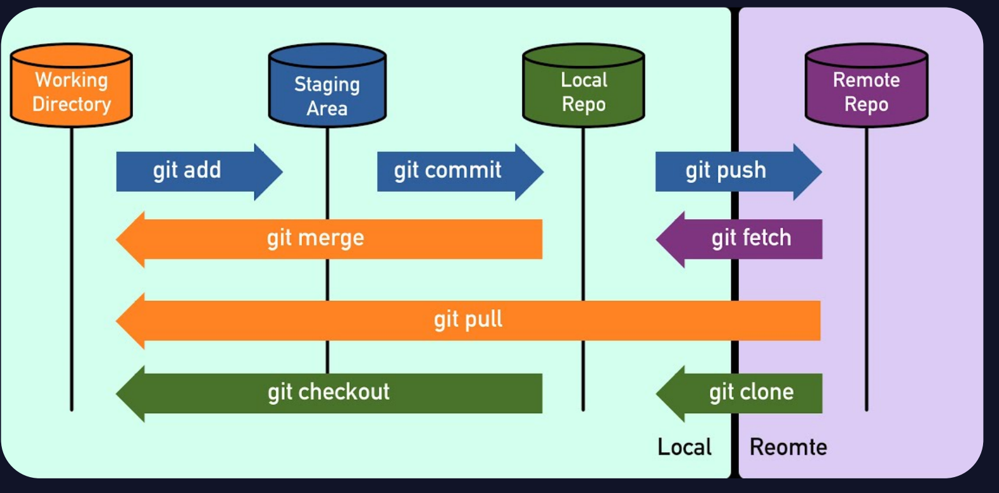

Week 1
=============

* git을 사용해야 하는 이유
 * git은 버전 관리 및 다른 개발자과의 협업을 용이하게 하기 위해서 사용한다.
-------------------------------------------------------------------------
* git 설치 및 세팅법
1. "https://git-scm.com/" 에서 git 설치
2. git 처음 세팅
 - git config --global user.name "깃허브 이름"
 - git config --global user.email "깃허브 이메일"
3. 관리할 폴더 설정
 - 관리할 폴더 생성
 - git init
4. Repositories 생성
 - git 사이트에서 Repositories 생성(관리할 폴더랑 똑같은 이름으로 생성)
 - 이후 나오는 command 입력(README.md를 생성안했으면 맨 위에 있는 command)
-------------------------------------------------------------------------
 * git에 파일을 업데이트 하는법
 1. git add "파일명"
 2. git commit -m "입력할 메세지"
 3. git push origin main
-------------------------------------------------------------------------
* git/git hub의 흐름

--------------------------------------------------------------------------
<https://github.com/swoon427/2024-1-Beginner-Study>